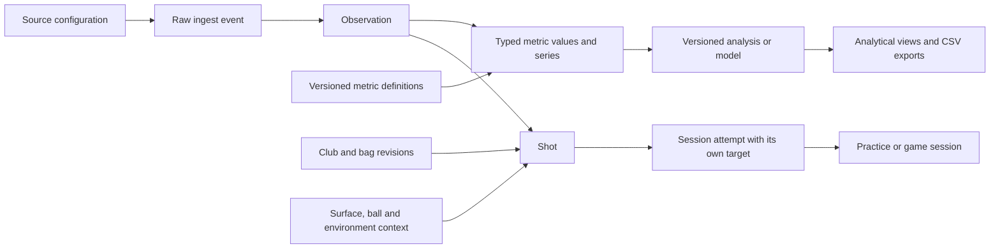

# TraceLoft storage and analytics proposal

Status: core SQLite schema/import, capture/practice persistence, CSV export and local backup/restore
implemented 2026-10-01; production cutover verification is recorded in WORK_LOG.md. A versioned manual
multiple-bag catalog and per-attempt equipment snapshots are now implemented for Distance ladder in
existing SQLite metadata/payloads, shared with Driving range. Range attempt payloads now also hold
immutable OpenGolfCoach estimates, synthetic flags and audited/reversible session-scoped bulk cleanup.
Full physical-equipment entities, cross-session cleanup/analysis sets, automatic outliers, course
entities and other vendor adapters below remain proposed.
Putting estimates now live in saved session/attempt outcomes with versioned context; they are exported separately from measured metric values. Calibration-model entities below remain proposed. See [model notes](docs/PUTTING_DISTANCE.md).
See [operation and recovery](docs/DATABASE_OPERATIONS.md) for the implemented scope.
Manufacturer documentation establishes metric
coverage and terminology; it does not establish that an accessible API/export exposes every metric.

## Recommendation and alternatives

Use SQLite on this PC, owned by the existing Python service, with relational shot/session/equipment
tables, an extensible typed metric registry, and convenient SQL views for everyday analysis. Preserve
original source records and the definitions behind every number. Add CSV export in the first migration
release, rather than postponing it until after analytics.

| Proposal | Benefit | Cost | Assessment |
| --- | --- | --- | --- |
| A. One wide shots table, with a column for every metric | Easy spreadsheet exports and SQL | Repeated migrations; awkward competing sources, profiles and definition changes | Good for a fixed device; too restrictive here |
| B. Shot metadata plus JSON containing all measurements | Easy ingestion of changing payloads | Definitions, units and validation drift; analytical SQL gets complicated | Useful for retaining raw input, insufficient as the analytical store |
| C. Relational entities plus typed metric values and stable views | New metrics without adding shot columns; traceable multi-source analysis; straightforward exports through views | More joins and deliberate mapping/versioning work | Recommended |

The flexible values table is constrained by a catalog and foreign keys. It is not an arbitrary bag
of string key/value pairs. A wide analytical view offers the convenience of A, without making that
view a second source of truth. Start with ordinary views; add reproducible caches only if profiling
shows a need. PostgreSQL would become useful if we later need multiple server writers or centralized
hosting; today's one-host Python service fits SQLite's intended use.
[SQLite deployment guidance](https://www.sqlite.org/whentouse.html).

## What the monitor research changes

These are representative advanced systems, not a ranking or an assertion that every metric is
available in every mode. Packages, software version, capture mode, markers, lighting and export
method can change what is actually supplied.

| System studied | Relevant coverage | Schema implication |
| --- | --- | --- |
| FlightScope Mevo Gen2 with Pro Package | Launch/flight metrics and attack angle/spin loft; Pro adds delivery geometry, low point, descent/curve, club speed and acceleration profiles | Store series as series; record full-swing/chipping/putting mode and package capabilities |
| Trackman full swing and putting | Detailed delivery/impact/low-point definitions, flight endpoints; putting adds stroke timing, tempo, skid, bounces, roll speed/percentage and distance at an entry-speed threshold | Definitions, reference points and thresholds are part of the data |
| ProTee VX / Labs | Launch/spin, delivery, face/lie, two impact coordinates; flight path, apex timing and simulated flight results | A camera reading and a simulated flight result need separate provenance |
| Foresight QuadMAX with club/putting options | Launch/spin, marker-dependent club capture; putting includes initial spin, skid, time to full roll and true-roll spin | Preserve launch-versus-roll phase and licensed/available channels |
| Uneekor EYE XO2 / VIEW | Launch/spin, flight outputs, impact location, path/face/attack/loft/lie, shot classification | Keep categorical results, software context and strike coordinates |
| Full Swing KIT | Common launch, spin, delivery and flight endpoints, including separate side carry and side total | Landing and final offline values are distinct |

FlightScope advertises 20 base parameters and 11 Pro additions, but those counts are not a universal
count of independent per-shot scalars. Its published putting list is launch speed, distance and
direction; the Pro additions apply to full swing and chipping. Face Impact Location is a separate
option with lateral/vertical strike coordinates and heat maps. A heat map is a group visualization,
not another measurement on each shot.
[Mevo Gen2](https://flightscope.com/products/mevo-gen2),
[Pro Package](https://flightscope.com/products/pro-package),
[Face Impact Location](https://flightscope.eu/products/mevo-club-face-impact-location).

Trackman's documentation distinguishes club geometry, launch, flight and putting phases. It defines
carry using a crossing at the launch elevation, and total using a calculated resting position. A
simulator landing on a raised green can therefore represent a different distance. Putting distance
at the documented 1.68 mph entry-speed threshold also differs from stopping distance. These meanings
must survive normalization. Spin loft is a three-dimensional angle; dynamic loft minus attack angle
should not silently become an equivalent measurement.
[Trackman parameter definitions](https://support.trackmangolf.com/hc/en-us/articles/5089892383515-Practice-Trackman-Data-Parameter-Definitions).

ProTee explicitly says launch/spin inputs drive simulated flight and that club measurements are
independent. Its published data families include impact coordinates and apex timing. Preserve the
provider's classification but apply a documented GolfData classification: for example, a ratio such
as smash factor is calculated even when marketing groups it with measured performance data.
[VX data list](https://proteegroup.com/the-power-of-vx/),
[ProTee measurement explanation](https://csc.protee-united.com/hc/en-us/articles/20326584674972-How-does-the-ProTee-VX-measure-ball-and-club-data-and-what-should-I-do-if-I-notice-discrepancies).

Foresight's putting material separates early launch/skid from calculated roll distance and makes
some club channels conditional on Clubhead Measurement. Its glossary also distinguishes face-center
measurements from local contact geometry, and spin components from total spin. Similar labels across
brands are not proof of identical measurement points or timing.
[QuadMAX putting](https://www.foresightsports.com/products/quadmax-putting-add-on),
[Foresight putting glossary](https://support.foresightsports.com/sites/default/files/files/Support%20Documents/EPA%20Putting%20Guide%20%26%20Glossary%281%29.pdf),
[QuadMAX modes and markers](https://support.foresightsports.com/quadmax-user-manual).

Uneekor publishes 24 ball/club data points, including a categorical flight type and impact point;
its displayed flight outputs and club data belong to the applicable device/software configuration.
KIT's list confirms that carry-side and total-side deserve separate fields.
[EYE XO2 data list](https://uneekor.com/en-us/products/eye-xo2-standalone),
[KIT data list](https://fullswingsports.eu/pages/kit-launch-monitors).

## Expansive metric catalog

The companion [proposed catalog](docs/data/metric_catalog.proposed.json) defines stable identifiers,
units and scalar/series types. It is a proposed union of documented metric families plus explicitly
reserved extensions. It is not a promise that the current capture collects them or a complete vendor
API specification. New scalar definitions generally require catalog entries and mappings, not a
database-table migration.

| Family | Fields to accommodate |
| --- | --- |
| Ball launch and spin | Speed; vertical launch; horizontal direction; total spin, axis, backspin, sidespin; vendor speed/spin differences and efficiency indices |
| Flight and landing | Carry; total; run; carry-side; total-side; curve; apex height/time/distance; flight time; descent angle; last tracked point; landing speed and landing/rest coordinates |
| Club delivery | Speed; path; face-to-target; face-to-path; attack angle; dynamic loft/lie; spin loft; swing direction/plane/radius; low-point distance/height/side; closure rate |
| Impact | Horizontal and vertical face-contact coordinates, with face origin and heel/toe convention |
| Putting stroke | Backswing time; forward time; tempo; stroke length |
| Putting launch/roll | Launch spin; bounces; skid distance/time; time to true roll; speed/spin at true roll; rolling proportion; stopping distance; entry-speed distance/side |
| Recorded outcomes | Observed stopping position, proximity and holed result, when actually available |
| Profiles and paths | Time-stamped club speed/acceleration, club trajectory, ball flight and putting trajectory |

Conditions and intentions belong in context/attempt records: surface/Stimp, slope, target distance
and direction, tolerances, ball model, lie, weather, elevation, normalization, club selection,
wedge swing length/feel and game state. Group statistics belong in analysis definitions/results:
sample count, mean, median, SD, percentiles, bias, dispersion ellipse, gaps and success rates. Neither
should be confused with a sensor's measurement of one shot.

For putting, keep initial ball speed, true-roll speed, and speed at the hole/threshold distinct.
Keep an observed stop distance separate from a model estimate. Stimp calibration, slope assumptions,
model version and inputs must accompany any modeled distance or required-pace calculation.

## Proposed entities and row meanings

Names below describe the expansive target schema. The core subset is implemented in storage.py;
the operations document identifies the remaining proposed entities and features.

| Entity | One row represents | Important fields / relationships |
| --- | --- | --- |
| `golfers` | A player, initially one local profile | UUID, display name, handedness; no account/login required |
| `sources` / `source_configurations` | A device/source and an immutable configuration revision | Manufacturer/model, firmware/software, acquisition method, enabled packages, mode, units, calibration/alignment and capabilities |
| `capture_streams` | An ingestion run/group, distinct from a drill | Source configuration, namespace, start/end, legacy capture-session ID |
| `ingest_events` | An incoming record, including failed/ambiguous reads | Stable receipt ID, source/stream sequence, raw payload or artifact, source time, receipt time, detection/validation status, reason, import identity |
| `shots` | One accepted physical-shot record | UUID, golfer, occurrence/receipt timestamps, timestamp precision/confidence, shot type, original equipment/context reference; no dependence on successful GSPro sending |
| `observations` | One source's report linked to a shot, or awaiting identification | Event, optional shot, source configuration, mapping revision; supports multiple sources without copying the shot |
| `metric_definitions` | An immutable metric definition revision | Stable key, version, dimension/unit, type, meaning, phase, reference frame and semantic variant |
| `metric_values` | One scalar value from one observation/calculation | Definition revision, typed numeric/text/boolean value, availability, method, source label/unit/raw value, mapping/run ID and quality details |
| `metric_series` / `series_samples` | A profile and its ordered samples | Definition, observation/run, time origin, units/frame, sampling information; sample time plus scalar or coordinate vector |
| `sessions` | A practice/game session | UUID, golfer, drill/version, start/end, status, original configuration, recoverable deletion timestamp |
| `session_attempts` | A prescribed repetition in a session | Ordinal, per-attempt targets/tolerances, optional shot, result, exclusion/reason and scoring revision; permits a future missed/no-read attempt without inventing a shot |
| `clubs` / `club_revisions` | A physical club and immutable specification revision | UUID, make/model/type; loft, lie, shaft, length, settings and effective dates |
| `bags` / `bag_revisions` / `bag_memberships` | A bag, its configuration and included club revisions | Many named bags; the same physical club can belong to several bags; historical membership is retained |
| `shot_contexts` / `shot_annotations` | Capture context and subsequent corrections/labels | Ball, equipment selection confidence, surface/weather/lie, target frame, swing intent, tags/notes; audited club reassignment preserves original selection |
| `analysis_sets` / `analysis_policies` / `inclusion_decisions` | A reproducible shot cohort, a versioned inclusion policy and an explicit scoped override | Draft/approved cohort revision and frozen metadata/inputs; shot/value/attempt reference, include/exclude/reset, reason, author/time, policy/version and superseded decision; keep measurement validity separate |
| `cleanup_batches` / `cleanup_items` | One applied bulk cleanup and its exact per-item corrections | Selected stable shot/value IDs, selection/context revision, reason, original/corrected club and bag revision or scoped inclusion state, author/time, before/after values and undo relationship |
| `outlier_runs` / `outlier_flags` | One detector run and one candidate flag | Exact baseline cohort/value revisions, method/settings, tested metric/residual, score/threshold, sample count and diagnostic explanation; review disposition is separate |
| `courses` / `course_revisions` | A course identity and immutable playable layout | Source/import revision/hash, local metric coordinate frame, scale/orientation/bounds, elevation assumptions; rounds retain the played revision |
| `course_holes` / `course_waypoints` / `course_features` / `course_assets` | A hole, named position, semantic surface polygon or supporting layout asset | Par, tee/pin selections; polygon rings/interior holes and overlap priority; asset rights/attribution, source/hash and import lineage |
| `rounds` / `round_holes` / `round_events` | A round, a hole instance and an ordered shot/penalty/drop/concession/mulligan event | Course/layout revision, tees/pin, intended aim, shot link, before/after state and lies, coordinates/frame or remaining distance, stroke/penalty accounting and outcome provenance |
| `mapping_versions` / `derivation_runs` / `derivation_inputs` | An import transform or calculation and its lineage | Exact mapping bytes/hash; algorithm/version/settings/calibration; input value IDs; previous results retained |
| `artifacts` / `delivery_events` / `audit_events` | Supporting evidence, outbound delivery, or a lifecycle edit | Relative file reference/hash/retention status; GSPro transport status/known acknowledgment; exclusion/delete/restore/correction history |

An accepted shot can exist outside practice. A failed OCR row remains an event rather than another
physical shot. Linking reports from two monitors to one shot requires explicit correlation evidence;
matching values or nearby timestamps alone must not automatically merge them. Support a later
link/split correction with audit history. Practice membership never owns the underlying measurements.

A 56-degree wedge bent to 55 degrees retains the same physical club ID and gets a new specification
revision. Historical shots retain the revision used then. Bag snapshots do not change when a bag is
edited, and a generic GSPro label such as SW is not enough to identify a particular physical wedge.

Deletion sets `sessions.deleted_at` and is recoverable. It does not cascade into raw shots, events,
crops or training archives. Session analysis excludes deleted sessions by default; an explicit capture
archive view can still include their preserved shots. Exclusions apply to the attempt/analysis scope,
so excluding a warm-up in a drill does not erase the observation everywhere. Queries count distinct
shot IDs when a shot belongs to more than one analytical collection.

## Shot exclusions, outliers and the cost of inconsistency

Added requirement, 2026-10-01: support range practice and simulator-round practice, including specific
shot exclusions, optional automated detection, and analysis of where bad shots finish and what they cost.
All behavior in this section is proposed; the current app only has putting-session inclusion toggles.

### Separate validity, unusualness and performance

An unreliable reading, an unusual real shot and a costly shot are different judgments. A topped 7-iron
can be a valid reading, a statistical outlier and important evidence of inconsistency. An exceptionally
good shot can also be an outlier. A normal-looking shot into a hazard can be costly because of aim or
course layout. Flags must not imply capture error or poor performance by themselves.

| Analysis purpose | Recommended default |
| --- | --- |
| Typical club distance / wedge calibration | Use valid comparable observations; show median/percentiles and allow deliberate scoped exclusions; automatic flags remain visible |
| Range consistency and miss tendency | Include real mishits; show all-valid and selected/filtered results side by side with counts and exclusion reasons |
| Simulator round performance | Include every counted stroke and penalty; distance-calibration exclusions do not remove those strokes |
| All-attempt practice during a round | Retain both original and replay/mulligan shots, identifying which actually counted in the game |
| Capture quality diagnosis | Review questionable values against raw evidence; invalid values do not become real performance misses |

Manual include/exclude controls should work in range and round review as well as putting. Reasons
include warm-up, different swing intent, wrong club assignment, sensor error and genuine mishit. A
mishit label does not automatically exclude it. Decisions can apply to a named analysis set, a session
attempt, or a specific metric/value. A suspect spin reading need not discard otherwise valid launch
speed. Metric-level exclusions affect analyses that require that metric; missing endpoints still leave
the shot in shot counts. Provide Include again / Reset to policy, and preserve the decision history.

Automatic detection should **flag for review by default**. An optional automatic-exclusion policy can
filter a named range calibration/analysis view, with visible counts and one-click inclusion overrides.
It cannot delete measurements, change round scoring, or erase shots from the all-valid inconsistency
view. Manual overrides take precedence over the selected policy and survive detector reruns. Store
flag reviews separately (confirmed unusual, sensor error, expected shot, dismissed), so human judgment
does not overwrite the detector's evidence.

### Initial detection proposal

Start with transparent rules and robust univariate screening using a median/MAD modified Z-score.
NIST documents this candidate-labeling approach and cautions that unusual observations are not
necessarily erroneous. A threshold such as absolute modified Z-score greater than 3.5 is an initial
screen, not a validated golf-specific cutoff or a probability that a reading is wrong.
[NIST outlier guidance](https://itl.nist.gov/div898/handbook/eda/section3/eda35h.htm).

Compare similar shots: golfer, physical club/revision, full/partial swing intent, target, lie, ball,
source/configuration and measurement definition. A chip, punch, bunker recovery or intentional lay-up
must not be judged against stock full swings. For random drills and changing approach yardages, screen
target-relative errors/residuals, not raw distance or speed. Detection against a historical baseline
stores its exact cohort; session reanalysis stores a new run rather than silently replacing old flags.

Propose a configurable minimum of 20 comparable valid shots for the initial statistical screen,
subject to validation; below that, show Insufficient comparable data. If MAD is zero or a needed field
is missing, abstain and explain. Never divide by zero or replace missing values with zero. Flag high
and low tails; do not automatically name them bad shots. Thresholds, metric selection, measurement
resolution, repeated-testing behavior and baseline choice need isolated validation. Later multivariate
methods can assess unusual combinations, but should not precede a useful explainable first version.

Retain method/version, input value IDs, baseline membership, sample size, thresholds, scores, reasons
and review status. A detector score is not a universal confidence percentage. Switching club identity,
inclusion policy or baseline creates a new analytical result; the original observation stays intact.

### In-app cleanup before approving analysis

Added requirement, 2026-10-01: a per-club review view with bulk correction and analysis exclusion,
including fixing a forgotten club change. Captures save immediately and remain recoverable. Review
and approval are analytical states, separate from a session's recording/completion state; no draft
cleanup blocks capture or creates an unsaved-shot window. Approval publishes a versioned analytical
cohort or bag/wedge profile, not a replacement for the raw history.

Proposed flow: session/range review or bag analysis -> Data cleanup -> club group and shot selection
-> action preview -> Apply cleanup -> refreshed review -> Approve analysis/profile. Cancel returns to
the original review without applying drafts; Undo reverses an applied batch. These screens and paths
are proposed, not additions to the currently verified navigation map.

The view should show each club's total/assessed/flagged/reviewed counts, distributions and a chronological
shot table. Highlight outliers with the metric/reason, baseline, source quality and original club label.
Offer filters for club/bag, date/session, intent, pending review and quality flags; inspection opens the
source measurements and available crops. Show separate carry/dispersion plots only when those fields
exist. Abrupt groups after a club switch may be worth reviewing, but unusual values alone do not prove
which club was used. Similar-club suggestions can be advisory; reassignment requires a user decision.

| Bulk action | Preview and effect |
| --- | --- |
| Reassign physical club / bag association | Selected shot IDs/count, original assignments and proposed physical club/specification revision; preserves source-reported labels |
| Exclude from named analysis | Explicit scope, reason and affected statistics; retains measurements and counted round results |
| Include again / reset exclusions | Explicit scope and the manual override or policy being restored |
| Set intent, tag or review disposition | Stock/partial/punch/warm-up/mishit/sensor issue and notes; no inferred erasure |
| Undo applied batch | Restore the prior correction/inclusion revision and refresh affected analytical results |

Allow individual selection, shift/range selection and explicit Select all matching filters across pages.
The UI must distinguish visible-page selection from all matches and show the affected count. Preview
before/after club sample counts, typical distances and flag counts, including a sample of changed rows.
Freeze selected IDs for the preview; arriving shots are not silently included. At Apply, check relevant
row/policy revisions and ask the user to refresh a stale preview rather than overwriting another edit.
Validate historical club specification and bag membership; do not assign today's equipment revision
to old shots blindly. Commit a batch atomically with an audit reason and exact before/after values.

Keep original reported assignment, corrected analytical assignment and correction history distinct.
Changed club/intent/inclusion membership invalidates affected club aggregates and detector baselines;
rerun into a new analysis revision and mark prior results stale. Preserved manual overrides retain
their named scope; review incompatible overrides explicitly. Undo appends a reversal and also refreshes
dependent results; conflicting later edits require resolution rather than blanket restoration.

An approved cohort freezes its shot/value IDs, corrected metadata and inclusion/detector revisions.
Later cleanup creates a new draft revision, leaving prior exported/approved results reproducible.
Original simulator outcomes and scores remain the events that were played. A club correction must not
reroll random outcomes, replay a shot or retroactively move its recorded ball position; optional model
recalculation is a separate labeled scenario.

### Outlier and mishit rates over time

Provide per-club and overall session/week/month trends with numerator, denominator, policy/baseline
version and coverage. Show range versus built-in-sim rounds separately, with filters for swing intent,
target/distance band, lie and source configuration. Distinguish these series:

- **Detected outlier rate:** unique valid comparable shots flagged by the selected rule divided by
  unique valid comparable shots actually assessed under that rule. A shot flagged on several metrics
  counts once in this shot-level rate; metric-specific rates have their own assessed denominators.
- **Confirmed mishit rate:** reviewed genuine mishits divided by reviewed comparable valid shots,
  with review coverage shown. Unreviewed candidates are not silently treated as good shots.
- **Data cleanup/quality rates:** wrong-club corrections, exclusions and invalid/unreadable values,
  with separate explicit denominators appropriate to shots or values and breakdowns by reason.

Show pending, unassessed and unavailable counts. Insufficient baseline samples, missing required metrics
or an unusable scale produce an unassessed result, not a non-outlier. A valid mishit excluded only from
bag calibration still contributes to the all-valid inconsistency cohort. Wrong-club corrections and
reading errors should be shown as data-quality changes, not claimed as improved golfing performance.

For illustration, 8 flagged shots out of 40 assessed is 20%, versus 3/50 = 6% in a later period. This
is only a comparable detector-rate change if definitions, threshold, baseline and shot conditions are
compatible; it is not proof of improvement by itself. Display sample sizes and uncertainty, and show
severity/direction and modeled cost alongside frequency when outcomes are available. A lower frequency
with more severe misses may still be worse for round performance.

Offer a frozen reference baseline for progress comparisons alongside an explicitly labeled adaptive
baseline for current typical performance. Save baseline training membership/cutoff; evaluate new shots
against the chosen reference without silently retraining it on those same shots. Changing a policy or
cleaning historical club assignments creates a new trend revision. Comparisons can recompute both periods
with one common policy/metadata revision while keeping the old results available. Annotate equipment,
source, cleanup and policy changes; an overall rate must account for changing club/lie/intent mix rather
than implying the golfer improved merely by hitting an easier mix of shots.

### Where misses finish and how much they matter

Save shot start, intended target/aim and final state, including course/hole/pin revision, start/end lie,
remaining distance, lateral/forward coordinates and coordinate frame where available. Distinguish carry
landing from final rest. Preserve hazards, penalty/drop events, recovery state, actual club/swing intent
and whether an outcome came from the simulator, manual entry or a GolfData model. Round event ordering
must retain original and mulligan branches, penalty accounting and gimmes/concessions without inventing
physical strokes. Simulator coordinates are simulator outcomes, not measured real-world ball endpoints.

The planned built-in 2D simulator is the intended primary source of this round data, per the user's
clarification. Its engine should emit an authoritative ordered event tied to the captured shot and
record the original launch measurements, modeled travel, before/after ball position and lie, target/pin,
penalties, rule/model/course revisions and random seed or sampled adjustments. Store the played outcome
as simulator provenance; retain enough inputs for replay and separate alternative scenarios. The
simulator knows its own state, so a GSPro outcome integration is not a prerequisite for this workflow.
The built-in simulator and its event writer are planned features, not currently implemented services.

[The Fuse evaluation](docs/FUSE_EVALUATION.md) proposes a course contract informed by OpenGolfSim's
SVG/GLB workflow. Persist semantic playing surfaces alongside any display map; an image alone cannot
determine lie or penalties. Start with JSON polygon geometry in SQLite and original course data.
Declare units/transforms and retain asset permissions/import provenance. Round events reference the
immutable played layout, chosen tee/pin and surface/rules identity; later course edits do not rewrite
historical endpoints. Fuse integration and physics validation remain proposed.

Useful views include:

- Target-relative miss plots: short/long and left/right, split by club, distance band and shot intent.
  Add course overlays only when reliable layout/coordinate data exists; allow simple relative plots.
- Miss destinations: rough, bunker, penalty area, out of bounds and recovery situations, with counts
  and denominators. Unknown outcomes remain unknown and contribute to the displayed coverage count.
- Typical versus all-valid dispersion and distances, plus frequency/severity of user-defined costly
  misses. Show the full distribution and both good and bad tails rather than only a trimmed average.
- A ranked list of costly shots with endpoint, lie, penalty and links back to the original evidence.
  Statistical unusualness and target/score consequence appear as separate labels.
- Contributions by club, tee/approach/short-game/putting category, distance band, hole and date. Distinguish
  observed extra recovery/penalty strokes from model-attributed cost; do not blame all subsequent
  poor strokes on the first miss.

For score impact, a later strokes-gained model can compare expected strokes remaining at the starting
and finishing states. For a transition that includes a shot and attached penalties:
`strokes_gained = E(start state) - E(next playable state) - (counted shot + attached penalty strokes)`.
Holed state has E = 0. Count penalties exactly once; if a penalty is its own transition, do not attach
it again to the shot. Preserve an identified benchmark/version (personal, scratch or another skill
level), its supported distances/lies and model uncertainty. Broadie's published research supports
location-based shot valuation; adopting a Tour benchmark is not automatically suitable for this golfer.
[Broadie, Assessing Golfer Performance on the PGA TOUR (2012)](https://business.columbia.edu/sites/default/files-efs/pubfiles/4996/assessing_golfer_performance.full.pdf).

For example, a manual scenario replacing a short-right bunker miss with a typical endpoint from the
same starting situation can estimate the difference in remaining-strokes cost. Such comparisons are
counterfactual estimates, not the number of strokes the player certainly would have saved. Keep actual
round results and alternative scenarios separate, and do not treat a filtered subset's strokes-gained
sum as the original round total. Report gross losses, gains and net contribution separately.

Current screen capture lacks hole state, final coordinates, lie and penalty outcomes. The built-in
simulator will supply its played states once implemented; its modeled endpoints remain distinct from
the captured measurements. A benchmark is still needed for strokes-cost estimates. Manual entry or a
future external simulator adapter can be optional additional sources. Never reconstruct those endpoints
by assuming every scraped shot is a full swing.

## Value contract and analytical comparability

- Use meters, meters/second, seconds, degrees, RPM, millimeters for face impact, and dimensionless
  ratios as canonical units. These are deliberate golf-friendly choices, not a claim that every unit
  is SI. Keep original values/units and precision; convert for mph, yards, feet or inches at export/UI.
- Horizontal launch/path/face angles use target-relative right-positive and left-negative where the
  documented definition permits it. Attack angle is upward-positive. Keep handedness separate.
  Impact, spin and low-point signs require source-specific verification; never apply a global flip.
- Identify geometric variants explicitly: flat versus actual landing elevation, radial versus forward
  carry, target-relative versus launch-relative curve, shaft lie versus toe-up deviation, face center
  versus local contact point, and initial versus rolling phase. An unresolved variant stays flagged
  and outside comparisons requiring that meaning. A shared display name does not establish equivalence.
- Separate acquisition (`screen_ocr`, file, API, manual) from value method (`measured`,
  `provider_calculated`, `golfdata_calculated`, `simulated`, `manual`, `provider_unknown`). Record the
  provider's original claim as well. OCR can acquire a measured launch value or a calculated distance.
- Missing is NULL/absent, never zero. Preserve reasons such as not supplied, not licensed, unreadable,
  invalid or unknown. Source capabilities explain routine absence; do not create every missing metric
  row on every shot. Store explicit invalid/unreadable fields when the receipt supplies them.
- Preserve source quality flags and OCR match details separately. Unknown confidence is unknown;
  do not equate unlike vendors' confidence scores or invent a common accuracy percentage.
- Preserve device/software/calibration changes, actual/normalized conditions and algorithm versions.
  Defaults group compatible observations; deliberately mixing configurations should be explicit.
- A preferred-value selection selects an actual value ID for each shot/metric/variant under a named,
  versioned policy. Never silently overwrite a provider value with a GolfData calculation or average
  conflicting devices. Views must not multiply shots when multiple observations provide a metric.
- Enforce exactly one typed value when available, finite numbers, matching catalog types/units,
  valid foreign keys and unique value revisions. Use source-scoped receipt keys for idempotency;
  preserve separate valid shots with identical numbers. Corrections append a revision rather than
  editing raw evidence. A derived result references its exact inputs and run; a series has a declared
  sample shape, ordered time axis and frame. Schema versions and metric versions are separate.
- Store UTC plus original source time, timezone/offset when known, precision and time origin. Receipt
  time is not impact time. Date filters choose the golfer's reporting timezone and UTC range bounds;
  daylight-saving ambiguities in older local timestamps must be retained, not guessed away.

## Mapping file proposal

Use a declarative JSON file per actual input format/version, not one universal brand file. The
[example](docs/data/metric_mapping.example.json) includes the existing GolfData/Foresight parsed
fields and a disabled Trackman label illustration. Neither is a production adapter.

Each entry should define source field/label, metric definition revision, source/canonical units,
conversion, sign/frame, semantic variant, missing handling, mode/package conditions, validation and
provenance. The service accepts only a small set of implemented transforms; the file cannot execute
Python or arbitrary formulas. Compound parsers and derived models are named/versioned application
functions with tests and explicit dependencies. Preserve unknown fields in the raw receipt and report
them as unmapped, so an importer upgrade can recover them later.

For example, current `launch_dir`, Trackman Launch Direction and Uneekor Side Angle are candidates
for `ball.launch_direction`; club Face Angle belongs to `club.face_angle`. Total-side distance and
launch direction are not interchangeable. Map labels only after checking units/frame in a real
sample export. Do not assume a Pro Package metric is exposed by GSPro just because the vendor app
shows it. Preserve mapping versions so corrected mappings can produce new values alongside old ones.

The legacy CSV's `fs_shot`, `count`, `latency_ms`, raw OCR and sent-spin columns are event/delivery
evidence, not new ball-measurement fields. Physical shot IDs are ours; source shot numbers can reset.

## Analysis and CSV export

Provide saved filter presets: local date range, golfer, session/drill/status, physical club/revision,
bag revision, swing intent, target, source/configuration, actual/normalized conditions, quality and
inclusion policy. SQL views support tools outside the app through a consistent exported snapshot.
Keep arbitrary write SQL out of the web UI; a later analyst query mode can use a read-only connection,
bounded queries and a verified database snapshot.

Examples this design supports:

- Carry median, 10th/90th percentiles and dispersion for each club in a bag over the last 90 days,
  separated by club revision and flight definition; show sample counts and missing coverage.
- A wedge matrix by physical wedge and swing feel/length, filtered to the same ball/lie/conditions.
- Putting pace-error and start-line distributions across dates, with each putt's own random target.
- Equipment/source change comparisons and measured-versus-modeled putting residuals after calibration.
- Shot-level correlations and rolling trends, with repeated attempts and small samples made visible.

Support user-defined tags and saved analytical cohorts (for example, a swing cue or practice experiment).
Permit custom metric definitions through the same typed/versioned registry. Calculations use registered
functions with dependencies and units; no unrestricted executable expressions in mapping JSON. Keep
dispersion versus uncertainty distinct and expose sample counts, percentile conventions, exclusion
rules and population/sample SD choices. An apparent trend is not automatically a causal finding.

Exports planned for the first release:

| Export | Grain and use |
| --- | --- |
| `shots.csv` | One row per accepted shot, selected metrics with unit suffixes, stable IDs/date/club/bag/source context; convenient for Excel/pandas |
| `session_attempts.csv` | One row per attempt, including targets/tolerances, result, exclusion and shot ID; preserves random drills and avoids ambiguous many-session joins |
| `metric_values.csv` | One row per value/version/source with canonical and original units, method, quality, variant and lineage; complete extensible analytical form |
| `summary.csv` | One row per selected grouping, with inclusion/missing counts, statistic definitions and reporting units |
| `shot_assessments.csv` | One row per scoped flag/inclusion decision with reasons, review/override and detector/policy/run IDs |
| `cleanup_history.csv` / `quality_trends.csv` | One row per correction item or per period/club/rate with reason, original/corrected assignment, numerator/denominator, coverage and policy/baseline/analysis revision |
| `round_events.csv` | One row per ordered shot/penalty/drop/game action with counted status, before/after outcome context and model references when available |
| Raw archive + metadata | Original receipts and an export manifest/data dictionary: filters, timezone, schema/catalog/mapping/policy versions and export timestamp |

Wide export uses an explicit metric selection; long export preserves all available metrics. Empty
cells mean unavailable. Related long exports expose missing reasons and provenance. Proper CSV quoting,
UTF-8, stable column names, full numeric precision and documented formula-safe handling of user-entered
text are required. Export all files from one read snapshot so counts and values agree during capture.
CSV is an interchange format; it cannot replace the relational backup, raw evidence or time-series data.
Inclusion flags and detector scores are annotations in export, not silently dropped rows. Offer explicit
All captured / All valid / Selected analysis exports, with shot and excluded counts and a policy manifest.
Keep actual round totals intact alongside any analytical subset. Existing historical putting exclusions
retain their session-only meaning during migration; they are not automatically global shot exclusions.

Indexes should cover shot occurrence/golfer, equipment revision, session/attempt order, source/event
idempotency, and metric definition plus observation. Add partial indexes for accepted/undeleted views
where useful. Calculate medians/percentiles/ellipses in a versioned analysis layer if necessary; do not
assume the installed SQLite build exposes every statistical aggregate. Validate counts and query plans
with representative synthetic multi-session data before optimizing further.

## Local storage, durability and backups

Implemented live location: `%USERPROFILE%\GolfData\data\golfdata.sqlite3`, configurable and outside
OneDrive. The original AppData proposal was replaced because Windows redirected that location into
the packaged Codex cache during cutover. Phones/browsers continue using the Python API; they never open or synchronize the
database file. The source repo can remain where it is. Moving storage does not require pairing or
changing the capture-owner rules.

Use foreign keys on every connection, schema migrations, short transactions and a service-owned writer
queue. Read connections may use WAL on the same machine. Plan `synchronous=FULL`, a bounded busy timeout,
and explicit persistence/error reporting; evaluate the actual latency before choosing weaker durability.
Do not block the per-frame detector with analytics. A durable receipt/outbox and commit acknowledgments
must allow recovery after a service crash; an in-memory queue alone is insufficient. A shot, its
observation, drill target/result and automatic completion should commit atomically. GSPro delivery is a
separate effect and must preserve the existing no-replay behavior after uncertain sends.
[SQLite WAL behavior](https://www.sqlite.org/wal.html).

SQLite does not provide off-device backup or multi-computer synchronization. OneDrive is not syncing,
per the user; treat current runtime data and existing archives as local-only. Proposed backup policy:
consistent snapshots after sessions and before migrations, daily/weekly retention, a manifest and
integrity checks, and a user-selected external disk or real remote destination. Until that destination
exists, clearly report local-only protection. Use the SQLite backup API for a live snapshot, not a copy
of only the live main file; committed data can still be in its WAL. Test restoration into an isolated
folder. The backup set includes referenced raw/profile artifacts and separately protected training
archives/configuration; rolling validation-crop policy remains 25 sets.
[SQLite backup API](https://www.sqlite.org/backup.html),
[WAL persistence](https://www.sqlite.org/wal.html).

## Migration and delivery proposals

1. **Foundation and safe importer.** Implement the registry/core schema, runtime-path configuration,
   backup/restore and dry-run importer. Preserve originals and create an import manifest with file
   hashes, row IDs and reconciliation counts. Import raw CSV rows, all practice JSON including trash,
   session/shot links, historical targets, exclusions and abandonment/deletion state. Repeated imports
   must be idempotent, including duplicate archived copies and distinct files sharing legacy keys.
2. **Capture and practice cutover with CSV export.** Validate atomic ingestion, crash/disk-full behavior,
   receipt recovery, no accidental GSPro replay, duplicate handling and all existing session journeys
   in an isolated instance. Reconcile source rows, accepted/ambiguous shots, links and every measured
   field. Switch the service to one database authority after verification; legacy files become retained
   import evidence or generated exports, not independent competing stores.
3. **Cross-session analytics and equipment.** Add bag/physical-club selection and revisions, analytical
   filters, saved views, wide/long/summary CSV, putting trends, bag gaps and wedge matrix collection.
   The export infrastructure belongs in step 2; richer grouping belongs here.
   Add scoped manual inclusion and flag-only outlier review before optional automatic calibration
   filtering. Add per-club cleanup, atomic bulk club/intent/inclusion corrections, Undo and reviewed
   analytical cohorts. Add outlier/mishit/quality rates with comparable baselines and explicit counts.
   Round miss maps use the planned built-in simulator's events; cost attribution also needs a benchmark.
4. **Additional sources and models.** Validate actual vendor CSV/API samples, then ship one adapter at
   a time. Add profiles, putting model calibration and game outcomes only with explicit provenance.
   Preserve game random seeds and rules/settings for replay alongside the unmodified source shot.

Legacy migration needs particular care: current CSV contains failed/logged reads as well as shots;
`sent=false` can mean validated with GSPro disabled, so it cannot determine acceptance by itself.
Practice JSON keys link confirmed readings using capture-session ID and sequence. Unknown CSV-only
acceptance stays unknown unless evidence resolves it. JSON and CSV can differ in precision; retain
both observations and their relationship rather than rounding one to force equality. CSV local time
has no timezone; JSON `captured` is a UTC ingestion time. Keep both. The capture's inactivity-based
session grouping is not the same entity as a user-launched drill. Missing club/flight/skid data cannot
be reconstructed by changing storage. Do not invent it.

Steps 1–2 have an implemented core storage/import/capture/practice/export/local-recovery foundation.
The work log records actual cutover and verification. Manual bags/clubs, range filters/cleanup and
versioned putting/full-flight model payloads are now implemented; cross-session analytics, full
equipment entities, additional source adapters and calibration entities remain follow-ups. Google Drive upload is the requested next backup design;
current snapshots are local-only. This document's future-facing schema remains broader than version 1.
