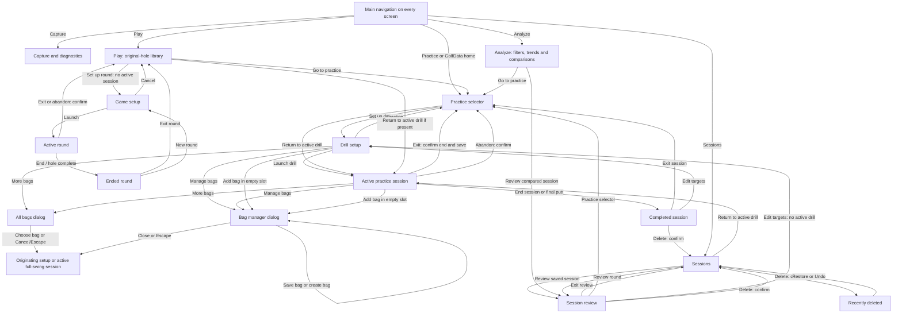

# TraceLoft web navigation

This map covers every direct screen transition and its guards. Longer journeys are combinations
of these paths. Choosing another screen does not stop capture or finish a drill; only End session,
confirmed Exit session, and confirmed Abandon session end the active drill.

Main navigation order: **Capture → Practice → Play → Analyze → Sessions**. Analyze has cross-session comparisons and filtered export. Play contains the original-hole library and 2D game.

## Screens and stable locations

| Screen | Location | Identity in the interface |
| --- | --- | --- |
| Practice selector | `#practice` | Practice navigation selected; four collapsible categories |
| Drill setup | `#setup/pace`, `#setup/line`, `#setup/combined`, `#setup/random`, `#setup/ladder`, `#setup/distance-ladder`, `#setup/driving-range` | Drill title and parameter form; Practice selected |
| Setup copied from saved results | `#setup/<drill>/<session-id>` | Parameters loaded from that saved session |
| Active or recently completed session | `#practice/<session-id>` | Putting practice, Distance ladder or Driving range; Practice selected |
| Session list | `#sessions` | Sessions navigation selected |
| Saved review | `#sessions/<session-id>` | Session review; Sessions selected; Exit review and Practice selector |
| Capture and diagnostics | `#capture` | Capture navigation selected |
| Play | `#play` | Original-hole cards and imports; active-session return and setup guard |
| Game setup | `#setup/golf-sim` | Rules/source/equipment; Play selected |
| Game runner | `#practice/<session-id>` | Play selected; round live/ended identity |
| Analyze | `#analyze` | Filters, median/IQR trends, distribution, equipment/session comparisons and CSV |
| Recently deleted | Within Sessions | Expandable section; restore controls |
| Confirmation | Modal over its originating screen | Cancel keeps the screen and data; confirm performs the named action |
| Service unavailable | Current requested location retained | Retry screen; Try again reconnects |

Capture includes AirPlay, HDMI and VDD profiles. VDD exposes an explicit secondary-display selector;
changing the profile sets the matching source. Preview is available before calibration and never
records shots. Start capture requires geometry and glyph training; VDD additionally requires a
trained calibration status. Controls lock during run/preview and Stop releases the owner before
they unlock. VDD guard errors stop capture without ending the drill. The source/display selection
does not introduce another route or alter Practice/Sessions navigation. VDD Capture/Preview/Stop and
Practice return were checked after this update; the previous 125-path audit predates these controls.

## Shared navigation

On **every** main screen—selector, setup, active session, completed session, review, session list,
Capture, Play and Analyze—the following paths exist:

| Control | Destination | Effect on an active drill |
| --- | --- | --- |
| Practice | Practice selector | Keeps it active; Return to active drill remains available |
| GolfData home | Practice selector | Same as Practice |
| Sessions | Session list | Keeps it active |
| Capture | Capture and diagnostics | Keeps it active |
| Play | Game entry/menu | Keeps it active |
| Analyze | Cross-session analysis | Keeps it active |
| Browser Back / Forward | Previous / next studio location | Reloads the screen, not a new session |
| Browser refresh or copied location | That same screen/session | Fetches current shared results; does not resume an ended session |

Setup edits are drafts until Launch drill. Back, Forward, refresh, and leaving setup reload defaults
or the saved source session's parameters; unsaved form edits are not retained.

**Distance ladder** adds the `#setup/distance-ladder` location (and
`#setup/distance-ladder/<saved-session-id>` for Edit targets). It uses the shared
`#practice/<id>` runner and `#sessions/<id>` review locations. Practice now has six drill cards.
Wedge/iron/custom presets and preview are controls within setup, not new screens. Another active
drill blocks both setup and launch. Capture must have the selected distance column; start/launch
guards explain an incompatible profile. Full-swing runners use shots/yd terminology and the same
End/Exit/Abandon, completed-banner, review, Delete/Undo/Restore paths as putting.

Distance-ladder setup and active runner include Bag/Club controls and **Manage bags**, a modal at
the same location. Close or Escape returns to the originating screen, discarding unsaved catalog
edits; Save bag/Create bag persists immediately without launching/ending a drill. Setup parameters
stay intact while the dialog is open. Live selection applies to upcoming shots only; changing bags
clears club. Stale catalog edits, duplicate names and invalid club membership explain the guard.
Finished/review sessions display frozen tags without next-shot controls. These affected journeys
were checked separately at desktop and 390 px on 2026-10-01: launch with club, live switch, second
bag/custom club, cancel/reopen, refresh, completion, saved review and copied setup. No new route.

The compact picker replaces the bag/club dropdowns with three quick bag tabs and club circles.
**More bags** opens a modal listing all bags; Cancel/Escape retains selection, choosing a new bag
clears club and returns to the origin with that bag visible. Empty quick slots open **Manage bags**
with the new-name field focused. Clear club records future shots untagged. Shared catalog updates
refresh setup's picker without discarding other parameter drafts; removed clubs clear the draft tag.
Follow-up isolated browser checks covered More bags/fourth-bag selection, keyboard club selection,
live switching with earlier tags intact, Clear club, bag-editor Close, copied setup, remote catalog
removal, stopped warnings and End session with capture still running. Desktop/phone runner and
tablet setup layouts had no horizontal page overflow. The empty-slot focus shortcut and Escape paths
were inspected in code but not exercised in this follow-up browser pass. Healthy capture uses only
the header; warnings remain above tagging and completion keeps its red banner. No new route.

## Detailed transition checklist

Verification status: the screen transitions and guards below exist in the app. The isolated browser
audit passed 125 checks, including every main screen's shared navigation, session lifecycle controls,
saved-review exits, history/refresh, and service recovery. Persistence-failure guards are additionally
covered by the existing web API tests; these failures were not induced in the user's live service.

The 125-check audit predates Distance ladder. Its affected paths were separately rechecked in an
isolated service on 2026-10-01: setup/launch guard, active return and exit cancel, completion/manual
end, abandon cancel/confirm, copied setup/refresh, saved review, exclusion, Delete/Restore, both
review exits and browser Back, with desktop and 390 px layouts. See WORK_LOG.md for this update's
actual evidence; the earlier audit is not used as its verification.

| From | Control or trigger | To | Guard / cancel behavior |
| --- | --- | --- | --- |
| Selector | Set up drill on any of six cards | Setup | Another active drill must end/abandon first |
| Selector | Return to active drill | Active session | Only offered when a drill is active |
| Setup | Practice / home / navigation | Chosen main screen | Creates no session |
| Setup | Launch drill | New active session | Valid parameters; another active drill blocks launch |
| Active session | End session | Completed results | Saves first; failure keeps session active |
| Active session | Final scored shot / putt | Completed results | Red Session over warning; capture may continue |
| Active session | Exit session | Confirmation → selector | Cancel keeps it active; confirm ends and saves |
| Active session | Abandon session | Confirmation → selector | Cancel keeps it active; confirm saves Abandoned results |
| Active session | Practice / home | Selector | Keeps the drill active; Return available |
| Completed session | Exit session | Selector | No confirmation; preserves results |
| Completed session | Edit targets | Setup with saved parameters | Creates a separate session only on launch |
| Completed session | Delete session | Confirmation → Sessions | Cancel preserves results; confirm moves to recoverable trash |
| Sessions | Review session | Saved review | Completed, abandoned and interrupted results stay in review mode |
| Sessions | Return to active drill | Active session | Clearly labeled as live, rather than Review |
| Sessions | Delete | Confirmation → Sessions | Active drill cannot be deleted |
| Review | Exit review (top or below log) | Sessions | Does not end another active drill |
| Review | Practice selector (top or below log) | Selector | Does not end another active drill |
| Review | Edit targets | Setup with saved parameters | Another active drill blocks setup |
| Review | Delete session | Confirmation → Sessions | Cancel stays in review; confirm keeps recoverable copy |
| Review / session | Select putt; exclude/include | Same screen | Results update; no navigation |
| Recently deleted | Restore session | Sessions | Restores results without resuming a drill |
| Deletion notice | Undo | Sessions | Same recovery as Restore |
| Capture | Preview / Start capture / Stop capture | Same screen | Changes capture ownership/status, not session navigation |
| Play / Analyze | Go to practice | Practice selector | No session or capture changes |
| Play | Return to active drill | Active session | Only shown when a drill is active |
| Capture | Export CSV | Download; stays on Capture | SQLite snapshot export; does not change capture/session state |
| Capture | Back up database | Same screen with verified local path | Creates a local snapshot; no Google Drive upload |
| Confirmation | Cancel or Escape | Originating screen | No data change |
| Confirmation | Browser Back | Previous screen | Cancels the dialog; does not execute its action |
| Unavailable service | Try again | Requested screen | Failure stays on retry screen |
| Missing/deleted review link | Load or refresh | Sessions | Explains unavailable session |
| Old live-session link | Another drill now active | Saved review of the original session | Does not switch to the newer drill |
| Invalid location | Load or Back/Forward | Selector | Replaces invalid location with `#practice` |
| Fresh launch without location | Service has active drill | Active session | No new session created |
| Fresh launch without location | Service idle or drill ended | Selector | No new session created |

## Verification evidence

- Five-section update (2026-10-01): fresh browser checks verify requested order, all five tabs,
  selected identity on Play/Analyze/review, Analyze refresh, Play Back/Forward, both placeholder
  exits to Practice, and return to the original saved review. Capture and sessions were not changed.
  At 390 × 844 all five controls are 45 px high and fit without horizontal overflow; the 850 px
  tablet header also fits. JavaScript syntax and new/old route checks pass; no browser warnings/errors.
  The existing Return to active drill handler is reused; its new placeholder visibility was not
  exercised with a live active drill. This is targeted evidence, not a rerun of the historical audit.

- Distance/ladder update (2026-10-01): isolated API and fresh browser checks cover the fifth drill setup, invalid range, ladder launch/advancement, exclusion, active setup guard, cancel exit, automatic completion/banner/footer exit, saved review, Practice selector, Back, copied parameters, descending launch and abandon cancel/confirm. Fixed distance setup and manual completion are checked separately. Phone setup/runner checks use 390×844. This is targeted new-path evidence, not a rerun of the historical 125-path audit.

- SQLite migration audit (2026-10-01): fresh isolated API checks cover completion, abandonment,
  exclusions, stale commands, active-session protection, deletion/restore and export/backup. Fresh
  browser checks on localhost:8766 cover review/selector exits, Random pace setup/launch, stopped-capture
  warning, manual completion/banner/footer exit, Back, CSV download and backup feedback. Review at
  390x844 has no horizontal overflow. This is new storage-cutover evidence, not a rerun of all 125 paths.

- Browser audit: `designs/navigation-audit.json` records 125 passing checks with destination screens
  and locations. It includes four drill setup/launch flows, all seven main screen states' shared
  controls, active-drill setup/deletion guards, manual/automatic completion, abandon/exit cancel and
  confirm, review-only interrupted results, exclusion, deletion, Undo, restore, missing/invalid
  locations, stale live links, Back/Forward/refresh and failed/successful retry after a simulated outage.
- Phone verification at 390x844: review header and footer exits work; Sessions remains selected;
  there is no horizontal page overflow. Screenshot: `designs/web-review-navigation-mobile.png`.
- All state-changing checks used localhost:8766 and temporary session files. Live localhost:8765
  verification uses only navigation and reads; capture and the user's session files remain unchanged.
- JavaScript syntax checks pass. The existing Python suite passed 73/74 tests while live capture was
  running. The worker-invalid-settings test expected a validation message but instead received the
  active capture-lock message. Capture was left running; all web/API tests in that run passed.
- Intentional limits: a browser cannot render the app's retry screen if the entire HTTP server is
  unreachable on a fresh load. Start the server and reload in that case. Unsaved setup drafts are not
  retained when leaving the screen. Review and practice use shared charts, with separate navigation
  identity and recording status.

## Driving range and demo paths — verified 2026-10-01

| Origin / control | Destination / effect |
| --- | --- |
| Practice → Driving range → Set up drill | `#setup/driving-range`; blocked while another session is active |
| Setup → Launch range / Launch demo range | `#practice/<id>`; real and synthetic identities are distinct |
| Active range → Change target | Modal; Save changes future targets; Cancel/Escape preserves them |
| Range → plot/table Inspect shot → Back to latest | Same runner; linked tiles/profile; latest follow resumes |
| Shot workspace → cleanup action | Selection/reason confirmation; Apply edits exact keys; Cancel preserves them |
| Removed filter → select → Restore | Same workspace; original exclusion state retained |
| Undo last cleanup | Same runner/review; latest remaining batch reversed |
| Active range → Practice/Sessions/Capture/Play/Analyze | Session stays active; Return to active drill remains |
| End / Exit / Abandon | Existing lifecycle guards and red completed/abandoned warning |
| Saved range review → Exit review / Practice selector | Sessions / Practice respectively |
| Results/review → New range / edit setup | `#setup/driving-range/<id>` copies parameters; active-session guard applies |
| Sessions → All/Real/Demo filter | Same list; deleted sessions remain under Recently deleted |
| Delete session → Undo / Recently deleted → Restore | Recover exact saved session, without resuming |
| Browser Back during modal | Dialog closes; no unapplied cleanup is saved |

Range QA used a separate database/service with synthetic inputs at desktop 1440, tablet 850 and
phone 390 px widths. Checked empty/live/ended/review states, refresh, back navigation, copied setup,
active-session guards, exits/cancellation, abandonment, header capture continuing after completion,
keyboard inspection, cleanup/Undo and recoverable demo deletion. The earlier broad navigation audit
is historical; this range audit verifies the changed paths, not every unrelated feature.

2026-10-02 range visual follow-up: Side view / Top view switches the selected-shot profile in place,
without changing the route, capture or session state. Isolated live/ended/saved-review checks confirm
shot inspection and Exit review still work. Club legend is informational; existing table filters
control membership. Desktop 1440 px and phone 390 px reviewed after this change.

2026-10-02 dispersion follow-up: no route changes. In the default Included state the table stays
included-only while the scatter retains excluded context. Excluded/Removed/All state filters apply
to both surfaces; circles always require included points. Fresh isolated checks covered exclusion,
Undo, removal/Undo, bag filtering, Carry/Total and plot-source changes, End and Saved review. Per-club
colors and circles persisted on review. iPad landscape and phone layouts were checked again.

2026-10-02 compact legend: the info button beside Shot dispersion opens contextual help in place;
no route/session change. Click/tap again, outside click, focus leaving or Escape dismisses it.
Hover/focus previews it and click/tap pins it. Fresh isolated click, keyboard, source-switch and
saved-review checks passed at large iPad landscape and phone sizes; physical touch remains unverified.

## Practice categories — 2026-10-02

Practice expands/collapses Full swing, Irons, Wedges and Putting in place. Expanded sections persist
in tab session storage; Return to active drill and completion warnings remain outside the groups.
Iron/Wedge ladder setup uses #setup/iron-ladder and #setup/wedge-ladder; existing distance-ladder
links still work. Both aliases use the same runner and session lifecycle. Refresh retains the preset.
Isolated UI checks passed: expand/collapse, keyboard Enter, preset setup/refresh, Back/Practice return,
1366 × 1024 and 390 × 844 with no horizontal overflow or console errors. No live capture changed.

## Bag mapping — 2026-10-02

Practice → Full swing → Bag mapping uses #setup/bag-mapping, then the shared #practice/<id> runner.
Saved review uses #sessions/<id>; new collection/edit setup copies its plan. Existing active-session
guards and exits apply. Fresh isolated browser checks covered two-club demo collection, club switching,
manual finish, reload, saved review and Exit review; 1366 × 1024 and 390 × 844 stayed within viewport.
Automated checks cover invalid plans, exclusions, saved model restoration and recoverable deletion.

## Wedge matrix — 2026-10-02

Practice → Wedges → #setup/wedge-matrix → #practice/<id>. Select a cell changes the next wedge
and swing together; direct swing buttons change upcoming intent only. Targets/recommendations do not
change the route. Finish/abandon/review and new-matrix setup reuse lifecycle guards and exits.
Isolated checks cover custom-label setup, two sampled cells, target suggestion, End, review and
390 px no page overflow. Shared cleanup, delete/restore and label freezing also have API coverage.

## Analyze — 2026-10-02

`#analyze` opens filters and comparisons; Apply refreshes the saved cohort. Mode/type changes reset
dependent filters. Session Review opens `#sessions/<id>`; the persistent Analyze navigation returns
to its filters. Practice and other global tabs remain available. Empty/error states provide reset.
CSV exports the current applied filters. No route changes session/capture ownership. Browser verified
real-empty/demo, club/metric/inclusion/session filters, review and return; API verified filtered CSV.

## Meadow One — 2026-10-02

Play → setup → round uses the shared stable session routes. Setup Cancel returns to Play.
Other active drills/rounds block launch and offer Return to active session. Visiting Play/Practice/
Analyze/Sessions leaves a round active; End round stops recording without leaving. Exit round confirms
ending (Cancel keeps it active) and returns to Play; Abandon confirms, saves and returns to Play.
Completion shows the red banner; New round copies saved rules. Saved review selects Sessions,
with Exit review, Practice selector, Play menu and recoverable Delete/Undo. Top and bottom exits exist.
Browser verified setup/reset/guard, map and button aiming, bag/club tagging, automatic finish, refresh,
review and exclusion preserving score, review exit, exit Cancel, abandon and deletion/Undo.
Primary landscape/reduced-height and phone widths checked in the isolated service.

2026-10-02 score/aim follow-up: no route changes. Map tap, keyboard aim button and numeric aim
update the two distance readouts in place. Live → automatic completion → saved review preserves
par and score components. Fresh isolated checks verified yards/feet and all four target viewports.

2026-10-02 terrain follow-up: Map display expands in place in active and saved rounds. Detailed
terrain and Show scoring boundaries only change rendering, retain keyboard focus and never call
shot/aim APIs. Aiming uses map taps, Aim at pin and numeric coordinate entry; left/right buttons
are removed. Fresh isolated checks covered switches, keyboard pin aiming, green zoom, completion
and saved review, with no route or scoring changes. iPad landscape and phone layout checks pass.

Play → Load Tour demo bag stays on Play and gives completion/already-loaded feedback. Sessions
opens the two DEMO collections; their existing review/exit/cleanup paths apply. Loading while a
round is active does not take ownership or change its tags. New demo round setup can select the
reference bag, then receive total-distance suggestions. The source link opens external documentation.

## Course importer — 2026-10-02

Play → Import a course → `#play/import`. Download or file input loads an unsaved draft; select a
hole → Preview → correct geometry → Save draft, or acknowledge review → Publish hole to Play. Source/settings changes invalidate
the preview acknowledgement. Publication stays in the importer and adds a version to the library without
starting or ending a round. ← Play returns to the library; imported-hole Set up this hole selects
that version in the shared round setup. Cancel returns to Play. Active sessions still block launch;
importing itself is available without taking capture ownership. Browser Back/Forward works; reload
preserves saved courses but clears an unsaved in-memory draft. Invalid routes return to Practice.
Open Jackson Park example loads the bundled, dated source in place without network access or a save.

## Club dispersion preview — 2026-10-02

No new route. Active round → bag/club → preview source/profile/visibility controls stays in place;
preview controls do not change aim or score. Empty profile → Bag mapping/Wedge matrix setup uses
the existing guard: with a round active it returns to Practice with the End/abandon explanation
and Return to active drill. Fresh isolated browser verified that return preserves the round.
Full-swing preview hides on the green and in ended/saved review; normal exits remain available.

Course workbench follow-up: Saved draft → Open draft restores source/settings/geometry with review
approval cleared; New import confirms replacing unsaved work. Export draft → file chooser opens a
separate draft copy. Save draft stays on the route; Publish saves the draft, adds a fixed library
version and stays in the workbench. Incomplete geometry may be drafted but cannot be published.
← Play → imported-hole setup → demo/live runner uses existing launch/exit guards. Applied edits
survive same-page navigation; refresh requires a saved server draft. Finish/cancel pending drawing
before navigation. Fresh isolated review covered reopen, correction/Undo, invalid pin publication
block, publish → setup → demo shot → End → Play → importer, and responsive layouts.

## Fictional hole library — 2026-10-02

Play now displays full-art cards for Meadow One, Willow Cove, Pine Bend and Meadow Reach.
Each Set up round preselects its immutable course ID in the existing `#setup/golf-sim` form;
Cancel returns to Play and the course dropdown can choose another hole. The shared round/session
routes and exits remain unchanged. Active sessions disable all four launch cards and provide
Return to active session. Each launch is a single-hole round, not a multi-hole tournament.
Fresh isolated browser review verified all three new card selections, Willow completion/banner,
partial-round End → Play, Meadow active guard → Return → refresh, and responsive card/runner layouts.
